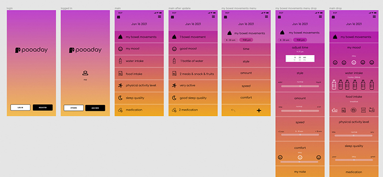
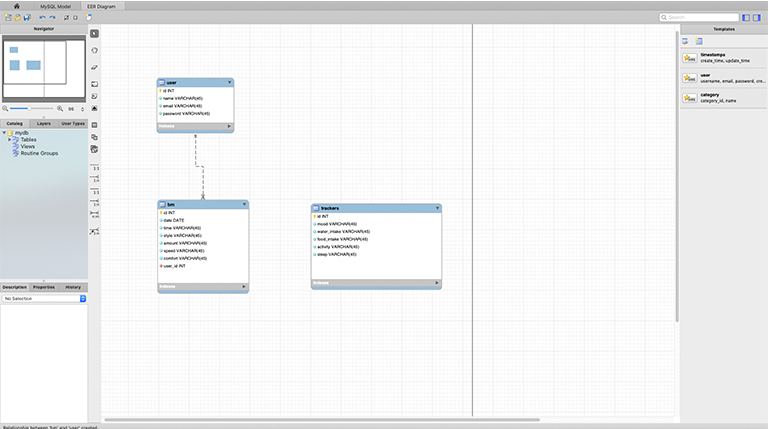
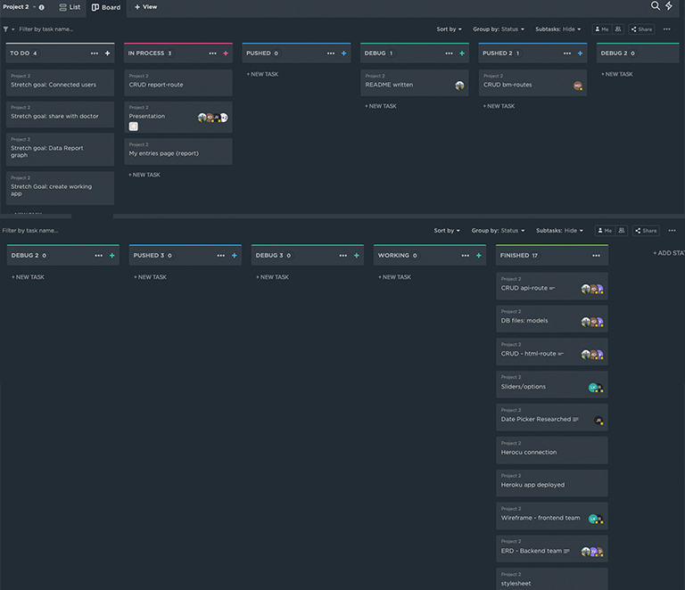

# [Pooaday](https://pooaday.herokuapp.com/)

    
    
    
    

## Description

We are going to build an application to track daily bowel movements in a fun, non-graphic way. With this app, we hope to help users develop healthier habits.

## User Story

If you've ever used an app to track your bowel movements and nutrition, you may have noticed that the market is diluted with poorly designed, clunky, or impractical features. Pooaday provides what you need to track your movements and the factors that will change them in one place. With our login features, you, your babysitter, or your health care provider can track data points for your health or your childs. This app will provide you with a better insight into the way your body is tuned and give you an idea on what you can change in terms of your daily habits to live a healthier life.

## Project Team

- ### Front End

  - [Jacob Riley](https://github.com/Jr-source)
  - [Lana Kim](https://github.com/lk9988)

- ### Back End

  - [David Vargas](https://github.com/davidvargas95)
  - [Joshua Haller](https://github.com/JJHPhoto)
  - [Mia Dilberovic](https://github.com/Dilberovicka31)

## Application Demo

To watch a video of the application being fully demo'd please use this link: [Application Demo](https://drive.google.com/file/d/158nwvUZgwwtkPSBULbAHCtoFH6kRBR_K/view).

## Workflow

To start things off, we had three proposals for Project 2. We quickly decided that Lana Kim's "Pooaday" app was the one we wanted to make. Her Figma of how the app could work blew us away.

With that wireframe, we spent a fair bit of time working on our ERD. We initially wanted our trackers table connected to our bm table. However, we decided that the bm table was our MVP and wanted that fully functioning before we decied to try and connect another table.

With that in place, we were quickly able to create our tasks for our team. We used ClickUp to track or progress on each task. We had various approval points before we marked a task as finished. We also picked who would be front end or back end at this time.

We faced various challenges in our project. We accidently used a beta version of Boostrap, but the front end team fixed that so fast that the back end team didn't even notice that. On the back end, we had a lot of examples from demos, class activities and Google. We tried quite a few ways to connect things but once we got them connected we were able to quickly move forward with other parts of our code. We also got a lot of support from Jamey, our TA. We also were able to take our code to our instructor and work through some routes we were confused on.

We spent the last week of our project trying to get all the functionality to work. We wanted our app to function as best we could, but also realize there were things we'd have to do in the future. Using ClickUp really helped us decided if the idea we came up fit with our goals to get a working MVP or if it was a stretch goal.

With that in mind, we have commited to getting this application fully working. We know that its a big task but we truly believe this application would be helpful to a lot of people.

## Future Goals

- Better Mobile Layout

- Be able to edit BMs

- Build out Report page to have more charts as well as monthly or yearly tracking.

- Exporting our data
  - Connected Users (Parents, doctors, caregivers, babysitters)
  - Multiple Trackers (kids, pets)

## Resources

- [Shields.io](https://shields.io/)

- [Font Awesome](https://fontawesome.com/)

- [Figma](https://www.figma.com/)

- [clickUp](https://clickup.com/)

## Technologies Used

  
  
  
  
  
  
  
  
  
  
  

